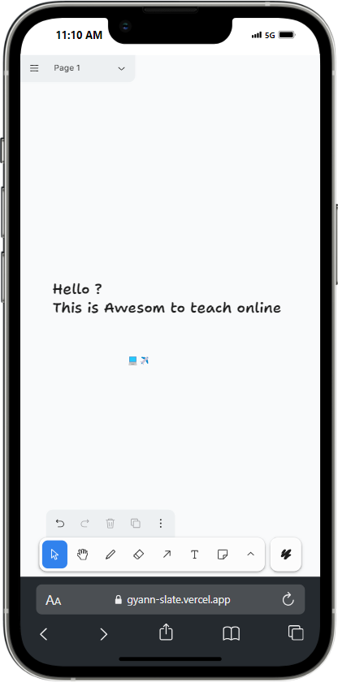

# GyaanSlate

GyaanSlate is a modern Progressive Web App (PWA) built with Vite + React, offering fast loading times, offline access, and a seamless user experience for educational content.

## Live Demo

Check out the live demo at: [GyaanSlate Live](https://gyann-slate.vercel.app/)

## Features

- Fast loading times
- Offline access
- App-like experience on any device

## Screenshots

### Browser View

### GyaanSlate Desktop Shortcut

### Install Permission

### Icon on Phone

### Laptop View

### Mobile View

